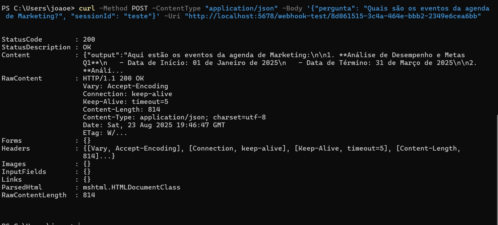
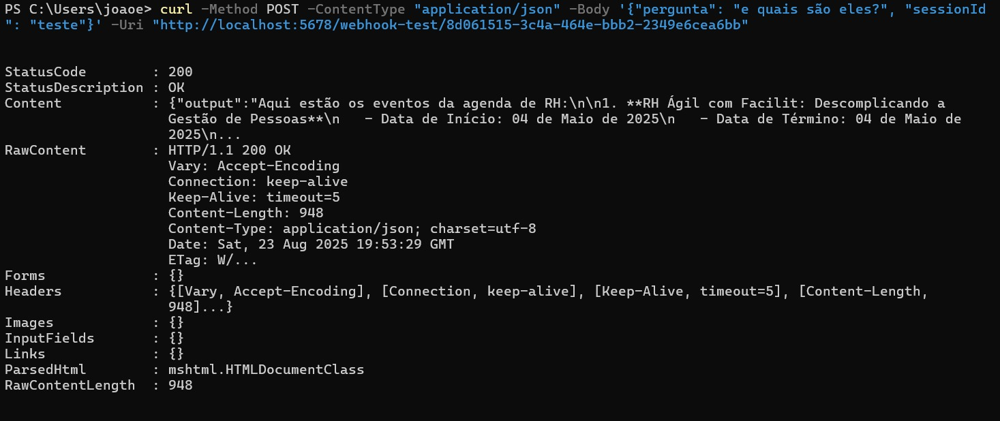

# Desafio Técnico: Agente de IA com n8n

> Status do Projeto: Concluído ✅


###  Índice
* [Sobre o Projeto](#-sobre-o-projeto)
* [Funcionalidades](#-funcionalidades)
* [Arquitetura da Solução](#-arquitetura-da-solução)
* [Stack de Tecnologias](#-stack-de-tecnologias)
* [Como Executar](#-como-executar)
* [Exemplos de Uso](#-exemplos-de-uso)
* [Endpoints da API](#-endpoints-da-api)
* [Relatório Detalhado](#-relatório-detalhado)


##  Sobre o Projeto
Este projeto é uma Prova de Conceito (PoC) de um sistema de Business Intelligence conversacional. Utilizando o n8n como orquestrador central, a solução permite que um usuário faça perguntas em linguagem natural e receba respostas precisas, consultadas diretamente de um banco de dados populado com dados de planilhas do Google Sheets.

##  Funcionalidades
- **ETL Automatizado:** Migração de dados das três planilhas Google Sheets para um banco de dados PostgreSQL.
- **API de CRUD:** Uma API robusta feita com FastAPI para servir de interface com o banco de dados.
- **Agente de IA Conversacional:** Um workflow no n8n que entende perguntas em linguagem natural.
- **IA com Ferramentas:** O agente de IA utiliza a API como uma ferramenta para buscar informações em tempo real.
- **IA com Memória:** O agente é capaz de lembrar o contexto de perguntas anteriores na mesma sessão de conversa.
- **Guardrails:** A IA se recusa a responder perguntas que estão fora do seu escopo de atuação (agendas e eventos).
- **Ambiente 100% Dockerizado:** Toda a aplicação é orquestrada com Docker Compose para fácil configuração e execução.

##  Arquitetura da Solução
A aplicação é composta por três serviços principais que rodam usando Docker:
* **Banco de Dados (PostgreSQL):** Armazena os dados das agendas.
* **API (FastAPI):** Serve como uma ponte segura e performática para acessar os dados.
* **n8n:** Atua como o motor de automação (ETL) e a inteligência do sistema (Agente de IA).

##  Stack de Tecnologias
* **Backend:** Python, FastAPI
* **Banco de Dados:** PostgreSQL
* **Orquestração e Automação:** n8n
* **Containerização:** Docker, Docker Compose
* **IA:** OpenAI (gpt-3.5-turbo)

##  Como Executar
### Pré-requisitos
* Docker
* Docker Compose

### Configuração
1. Clone o repositório.
```sh
git clone https://github.com/joaoeaa/desafio_tecnico
cd desafio_tecnico
```
2. Crie um arquivo `.env` na raiz do projeto e preencha as variáveis de ambiente necessárias:
```
 POSTGRES_USER=seu_usuario_aqui
 POSTGRES_PASSWORD=sua_senha_aqui
 POSTGRES_DB=seu_banco_aqui
 ```

### Execução

1. Na raiz do projeto, para iniciar todos os serviços (Banco de dados, API e n8n), execute o comando:
```sh
docker-compose up --build
```

2. A API estará disponível em `http://localhost:8000` (Documentação interativa em `http://localhost:8000/docs`)

3. O n8n estará disponível em `http://localhost:5678`

### Exemplos de Uso
**1. Consulta simples:**
```powershell
curl -Method POST -ContentType "application/json" -Body '{"pergunta": "Quais são os eventos da agenda de Marketing?", "sessionId": "teste"}' -Uri "http://localhost:5678/webhook-test/8d061515-3c4a-464e-bbb2-2349e6cea6bb"
```

**2. Testando a memória:**
```powershell
# Primeira pergunta
curl -Method POST -ContentType "application/json" -Body '{"pergunta": "Quantos eventos de RH existem?", "sessionId": "teste"}' -Uri "http://localhost:5678/webhook-test/8d061515-3c4a-464e-bbb2-2349e6cea6bb"


#Pergunta seguinte
curl -Method POST -ContentType "application/json" -Body '{"pergunta": "e quais são eles?", "sessionId": "teste"}' -Uri "http://localhost:5678/webhook-test/8d061515-3c4a-464e-bbb2-2349e6cea6bb"
```

## Endpoints da API
A API FastAPI expõe os seguintes endpoints em `http://localhost:8000`:
* `GET /events/`: Lista todos os eventos no banco de dados.
* `POST /events/`: Cria um novo evento.
* `GET /docs`: Acessa a documentação interativa (Swagger UI).

##  Relatório Detalhado
Para uma análise completa da arquitetura, decisões de implementação e desafios encontrados, acesse o Relatório Completo do Projeto.