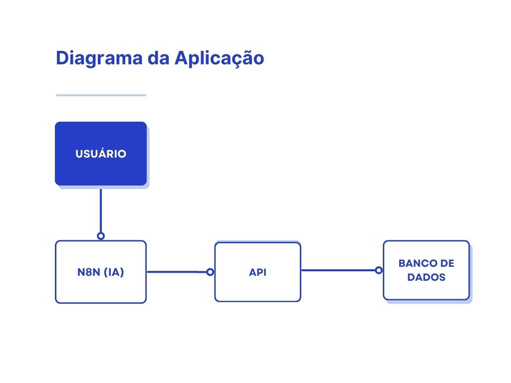

# Relatório Detalhado: Desafio Técnico de Orquestração de IA com n8n

**Autor:** João Andrade

**Data:** 24 de Agosto de 2025

---

## 1. Objetivo do Projeto

O acesso a informações de agendamento corporativo, muitas vezes espalhadas por diversas planilhas e departamentos, pode ser um processo lento e ineficiente. Este projeto teve como objetivo resolver esse problema através da criação de uma Prova de Conceito (PoC) de um sistema de Business Intelligence conversacional.

A solução final permite que qualquer usuário, através de uma simples pergunta em linguagem natural como "Quais eventos de Marketing acontecerão no próximo trimestre?", receba uma resposta precisa e contextualizada, consultada em tempo real de uma base de dados centralizada.

---

## 2. Arquitetura da Solução

Para construir um sistema robusto, modular e fácil de gerenciar, a solução foi arquitetada em três componentes principais, todos operando de forma integrada e containerizada com Docker e Docker Compose.

* **O Cofre (Banco de Dados PostgreSQL):** Um banco de dados seguro onde todos os dados das agendas de Marketing, RH e IA são centralizados. Ele serve como a única "fonte da verdade" para todas as informações de eventos.

* **O Garçom (API em Python/FastAPI):** Para garantir a segurança e o controle de acesso aos dados, foi desenvolvida uma API que funciona como um "garçom". Ela é a única camada que pode se comunicar com o banco de dados, recebendo pedidos para ler ou escrever informações e garantindo que tudo seja feito de forma padronizada.

* **O Cérebro (n8n):** Esta é a peça central do projeto, atuando em duas frentes:
    1.  **Organizador (ETL):** Inicialmente, o n8n lê as planilhas legadas do Google Sheets, transforma os dados (limpando, formatando e corrigindo-os) e os envia para a API, que os armazena no banco de dados.
    2.  **Assistente de IA:** Após a migração, um segundo workflow no n8n fica ativo, aguardando perguntas de usuários. Ele usa um modelo de linguagem da OpenAI para interpretar as perguntas, interagir com a API para buscar respostas e formular uma resposta final em linguagem natural.

---

## 3. Como Configurar e Rodar o Projeto

O projeto foi desenvolvido para ser executado em qualquer máquina com os pré-requisitos mínimos, garantindo uma experiência de configuração simples e rápida.

* **Pré-requisitos:** Docker e Docker Compose instalados.
* **Passo a Passo:**
    1.  Clonar o repositório do GitHub.
    2.  Criar um arquivo `.env` na raiz do projeto, preenchendo as variáveis de ambiente necessárias (credenciais do banco de dados).
    3.  Executar o comando `docker-compose up --build` no terminal, na raiz do projeto.
    4.  Após a conclusão, os três serviços (Banco de Dados, API e n8n) estarão rodando. A API pode ser acessada em `http://localhost:8000` e o n8n em `http://localhost:5678`.

---

## 4. Detalhes da Implementação de IA no n8n

A capacidade de conversação do sistema é impulsionada por um workflow de Agente de IA no n8n, configurado com três componentes principais:

* **O Prompt (As Instruções):** O "cérebro" da IA foi moldado através de um `System Message` (instrução de sistema) que define sua persona e suas regras de operação. O prompt instrui a IA a agir como um assistente de agendamento, a usar exclusivamente as ferramentas fornecidas para buscar dados e, crucialmente, a recusar educadamente qualquer pergunta que fuja do escopo de eventos da empresa. Isso cria "guardrails" que mantêm a IA focada e segura.

* **A Ferramenta (A Habilidade de Buscar Dados):** A IA não possui conhecimento prévio sobre os eventos. Para que ela pudesse responder às perguntas, foi-lhe dada uma "ferramenta": a capacidade de fazer uma requisição `GET` à nossa API. Através de uma descrição em linguagem natural, a IA aprendeu que, para qualquer pergunta sobre agendas, ela deveria acionar essa ferramenta para obter os dados reais do banco de dados.

* **A Memória (Contexto da Conversa):** Para permitir um diálogo mais natural, foi implementada uma funcionalidade de memória. Utilizando um `sessionId` enviado a cada requisição, o agente consegue lembrar das interações recentes na mesma conversa. Por exemplo, o usuário pode perguntar "Quantos eventos de RH existem?" e, em seguida, "E quais são eles?", e a IA saberá que a segunda pergunta se refere ao contexto da primeira.

---

## 5. Dificuldades Enfrentadas e Soluções

Durante o desenvolvimento, diversos desafios técnicos surgiram, servindo como importantes oportunidades de aprendizado:

* **Qualidade e Inconsistência dos Dados:** As planilhas de origem apresentavam formatos de data inconsistentes, texto extra nas células de data (ex: `(Trimestral)`) e até mesmo datas inválidas (ex: 31 de junho). A solução foi desenvolver expressões JavaScript robustas dentro do n8n para limpar, validar e padronizar esses dados durante o processo de migração, garantindo que apenas dados limpos e válidos fossem inseridos no banco.

* **Configuração do Ambiente Docker:** A comunicação entre os contêineres e a configuração de volumes persistentes apresentaram desafios iniciais, como erros de `ModuleNotFoundError` e `Connection Refused`. A solução envolveu a depuração sistemática dos arquivos `Dockerfile` e `docker-compose.yml`, ajustando a estrutura de pastas dentro do contêiner e a configuração de rede para que os serviços se comunicassem através de seus nomes (ex: `db`, `api`).

* **Autenticação com APIs Externas:** O processo de configuração de credenciais OAuth2 com a API do Google exigiu um entendimento detalhado do fluxo de autorização no Google Cloud Console, incluindo a configuração da tela de consentimento e a adição de usuários de teste. A depuração de erros como `invalid_client` e `access_denied` foi feita através da verificação minuciosa de cada passo da configuração.

* **Depuração de Workflows:** A depuração do fluxo de dados dentro do n8n e a identificação de erros na API foram facilitadas pelo uso dos logs do Docker (`docker-compose logs -f api`). Essa abordagem permitiu visualizar em tempo real os erros de validação (`422 Unprocessable Entity`) e os erros internos do servidor (`500 Internal Server Error`), possibilitando a correção precisa do código Python e das expressões no n8n.

---

### 6. Uso de Inteligência Artificial no Desenvolvimento

Conforme solicitado nos requisitos do desafio, este projeto foi desenvolvido com o auxílio de uma ferramenta de Inteligência Artificial. A IA utilizada foi o modelo de linguagem grande **Gemini**, do Google, que atuou como um assistente de programação e um consultor técnico ao longo de todo o ciclo de desenvolvimento.

A utilização da IA foi focada em acelerar a resolução de problemas e otimizar o aprendizado de novas tecnologias, aplicando-a nas seguintes áreas:

* **Geração e Depuração de Código:**
    * **API (Python/FastAPI):** O Gemini auxiliou na criação da estrutura inicial da API, incluindo a configuração da conexão com o banco de dados via SQLAlchemy, a definição dos modelos de dados e a implementação dos endpoints de CRUD.
    * **Expressões (n8n/JavaScript):** Para os desafios de transformação de dados (como a limpeza e formatação de datas complexas das planilhas).

* **Resolução de Problemas e Erros (Troubleshooting):**
    * **Docker e Docker Compose:** A IA foi utilizada para diagnosticar e resolver uma série de erros de configuração, como conflitos de `volumes`, erros de `COPY` no `Dockerfile` e problemas de rede entre os contêineres.
    * **Configuração de n8n:** O assistente ajudou a depurar o fluxo de trabalho, desde a autenticação com la API do Google até a correção de erros de sintaxe e lógica nos nós `HTTP Request` e `Filter`.

* **Documentação:**
    * A IA foi utilizada para garantir que todos os requisitos do desafio fossem cobertos de forma clara e profissional.

Em resumo, a Inteligência Artificial foi empregada como uma ferramenta de pareamento ("pair programming"), permitindo um desenvolvimento mais rápido, a superação de obstáculos técnicos complexos e a aplicação de melhores práticas em diversas frentes do projeto.